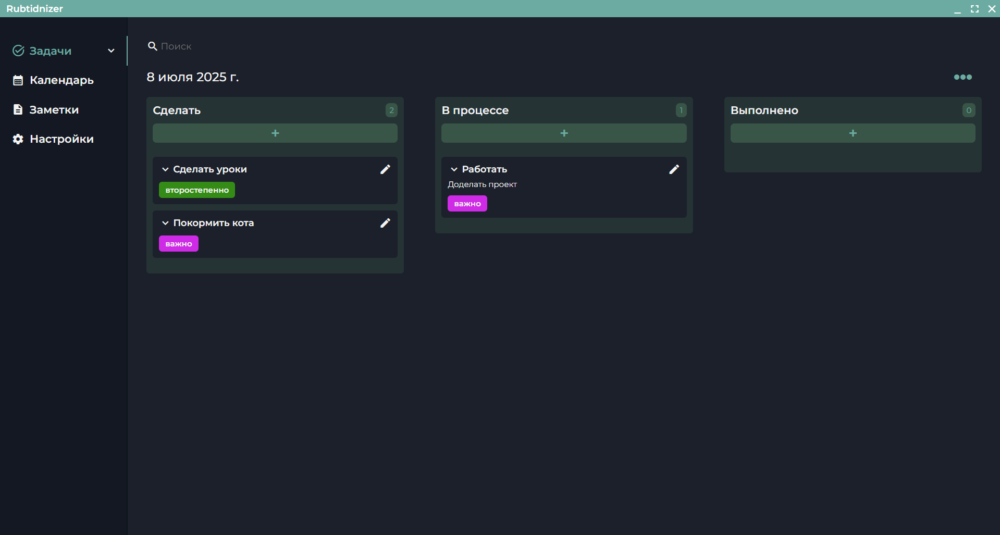

# 📝 Rubtinizer Todo Desktop App (Angular + Electron)

Настольное приложение для управления задачами, созданное с использованием Angular и Electron. Поддержка офлайн-режима, локального хранения и минималистичного UI.


## 📷 Демонстрация



> Приложение поддерживает добавление, редактирование, удаление и сортировку задач. Все данные хранятся локально.

## 🚀 Возможности

- ✅ Добавление/удаление/редактирование задач
- ⏱️ Уведомления в определенное время для задач
- 📌 Добавление меток задачам
- 📅 Наличие календаря и прочих заметок
- 💾 Локальное хранилище через IndexedDB / LocalStorage
- 🌓 Поддержка светлой/тёмной темы
- 🔋 Работает полностью оффлайн

## 🛠 Установка

```bash
git clone https://github.com/acidless/rubtinizer.git
cd rubtinizer
npm install
```

## 📝 Лицензия

Этот проект распространяется под лицензией MIT.
